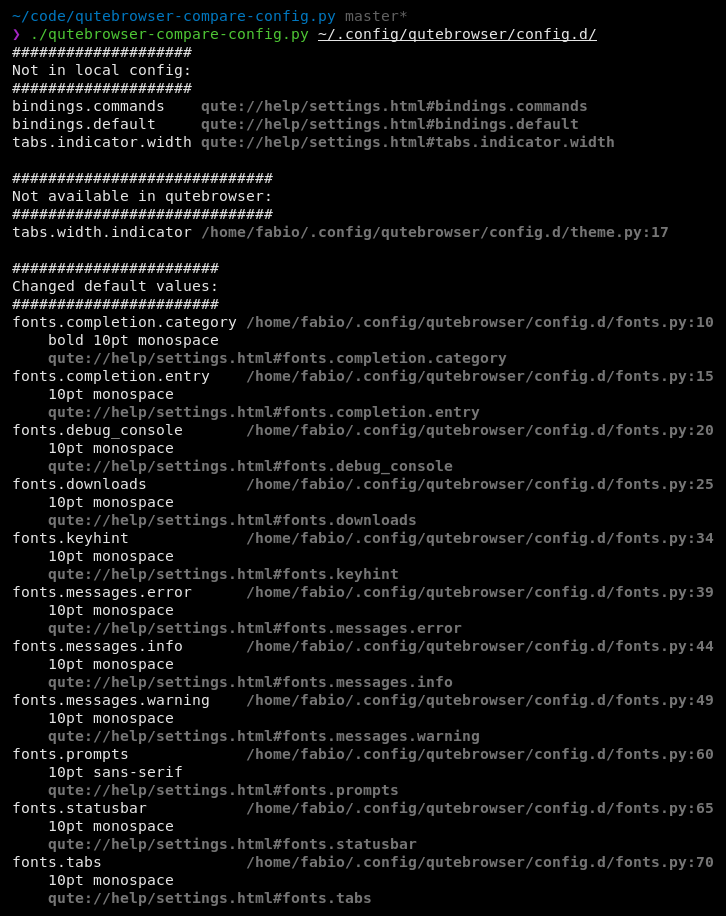

qutebrowser-compare-config.py
=============================

Find settings for `qutebrowser <https://github.com/qutebrowser/qutebrowser>`__ that are not present in local config
and vice versa.

1. Get the list of configurable settings from qutebrowser.
2. Parse local qutebrowser config file(s) and gather all present settings.
3. Compare the two lists.

Takes a list of config-files and/or config-file-directories
and parses all \*.py-files.

It also takes commented out settings from the local config into account.

Usage and options
-----------------

::

    usage: qutebrowser-compare-config.py [-h] [-m] [-d] [-n] [config [config ...]]

    Find settings for qutebrowser that are not present in local config and vice versa.

    positional arguments:
      config         List of config files or directories.Defaults to standard
                     location of config.py

    optional arguments:
      -h, --help     show this help message and exit
      -m, --missing  only list settings missing in local config
      -d, --dropped  only list settings not present in qutebrowser anymore
      -n, --naked    omit additional information (file/line-number/URL

Example screenshot
------------------

Known limitations
-----------------

There is no guarantee, that all of this works 100%. But for a well written
config, this provides a good starting point to clean up.
